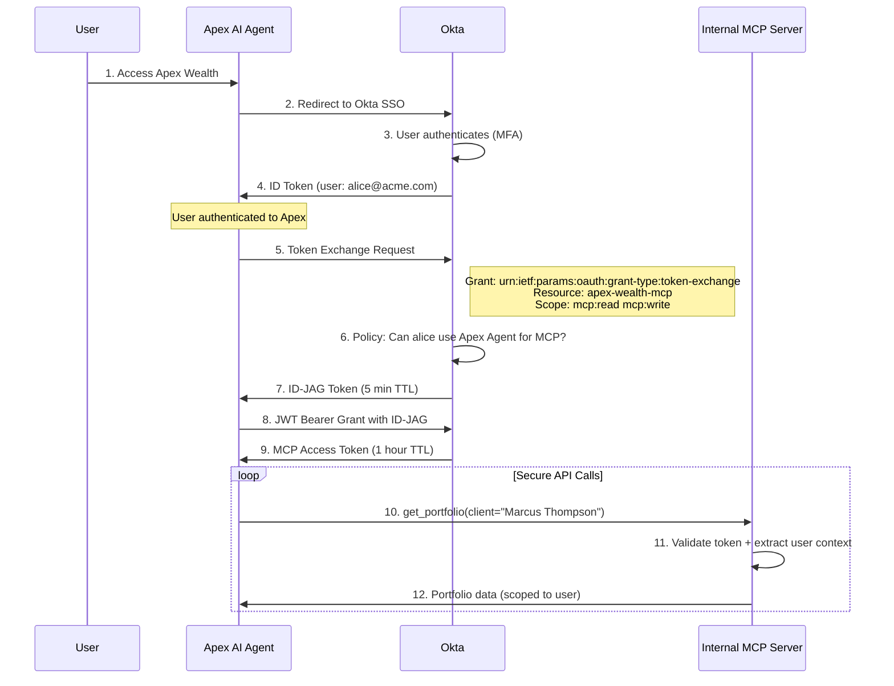
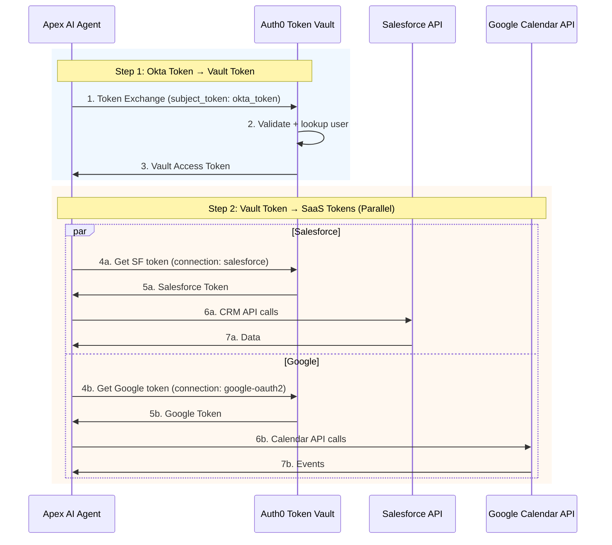
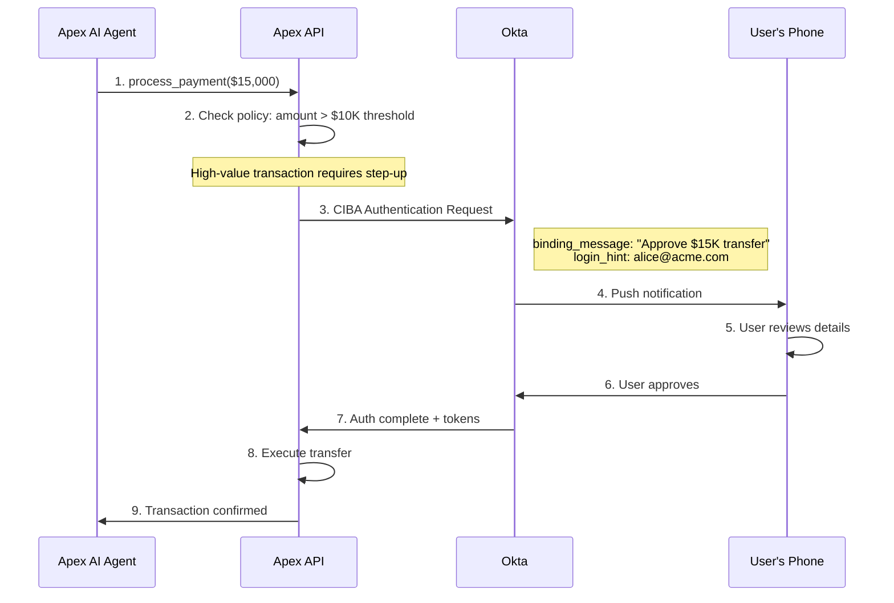

# 🏦 Apex Wealth Advisor

**AI-Powered Wealth Advisory Platform with Enterprise-Grade Agent Security**

A demonstration of secure AI agent architecture using Okta Cross-App Access (XAA), Auth0 Token Vault, and human-in-the-loop governance patterns.


---

## 🎯 What This Demo Shows

| Capability | Implementation | Why It Matters |
|------------|----------------|----------------|
| **Agent Identity** | Okta XAA with ID-JAG tokens | Agents get identity, not just API keys |
| **Credential Security** | Auth0 Token Vault | Zero stored secrets in application |
| **Multi-System Access** | MCP + Salesforce + Google Calendar | Single prompt orchestrates multiple systems |
| **Human-in-the-Loop** | CIBA step-up authentication | Policy-driven human approval for sensitive actions |
| **Natural Language Routing** | Claude AI with tool descriptions | Agent auto-selects tools without explicit routing |

---

## 🏗️ Architecture

```
┌────────────────────────────────────────────────────────────────────────┐
│                         APEX WEALTH ADVISOR                            │
├────────────────────────────────────────────────────────────────────────┤
│                                                                        │
│  ┌────────┐      ┌────────────┐      ┌─────────────────────────────┐  │
│  │  User  │─────▶│   Vercel   │─────▶│        Render API           │  │
│  │Browser │      │  Frontend  │      │    (Python/FastAPI)         │  │
│  └────────┘      └────────────┘      └──────────────┬──────────────┘  │
│                                                     │                  │
│                         ┌───────────────────────────┼───────────────┐  │
│                         │                           │               │  │
│                         ▼                           ▼               │  │
│               ┌─────────────────┐      ┌────────────────────────┐   │  │
│               │    Okta XAA     │      │   Auth0 Token Vault    │   │  │
│               │    (ID-JAG +    │      │ (Salesforce + Google)  │   │  │
│               │ Token Exchange) │      └─────────┬──────────────┘   │  │
│               └────────┬────────┘                │                  │  │
│                        │                   ┌─────┴─────┐            │  │
│                        ▼                   ▼           ▼            │  │
│               ┌─────────────────┐  ┌────────────┐ ┌──────────┐      │  │
│               │  Internal MCP   │  │ Salesforce │ │  Google  │      │  │
│               │    (5 tools)    │  │ (9 tools)  │ │ Calendar │      │  │
│               └─────────────────┘  └────────────┘ │ (5 tools)│      │  │
│                                                   └──────────┘      │  │
└────────────────────────────────────────────────────────────────────────┘
```

---

## 🔐 Security Flows

### Flow 1: Okta Cross-App Access (XAA) — Internal MCP Server

```
┌──────────┐    ┌──────────┐    ┌──────────┐    ┌──────────┐    ┌──────────┐
│  User    │    │  Okta    │    │  ID-JAG  │    │   MCP    │    │ Internal │
│ ID Token │───▶│  Token   │───▶│  Token   │───▶│  Access  │───▶│   MCP    │
│          │    │ Exchange │    │          │    │  Token   │    │  Server  │
└──────────┘    └──────────┘    └──────────┘    └──────────┘    └──────────┘
                                     │
                              Agent Identity
                              Claims Embedded
```

**Key Points:**
- RFC 8693 token exchange for secure service-to-service auth
- ID-JAG token carries agent identity claims
- MCP token scoped to `mcp:read` and `mcp:write`
- Short-lived tokens (5 min ID-JAG, 1 hour MCP)

### Flow 2: Auth0 Token Vault — External Services

```
┌──────────┐    ┌──────────┐    ┌──────────┐    ┌──────────┐    ┌──────────┐
│  Okta    │    │  Vault   │    │ Salesforce│   │  Google  │    │ External │
│  Token   │───▶│  Access  │───▶│  Token   │───▶│  Token   │───▶│   APIs   │
│          │    │  Token   │    │          │    │          │    │          │
└──────────┘    └──────────┘    └──────────┘    └──────────┘    └──────────┘
                     │
              No Credentials
              Stored in App
```

**Key Points:**
- Credentials retrieved on-demand, never persisted
- Scoped tokens per service (Salesforce CRM, Google Calendar)
- Token Vault manages refresh automatically
- Audit trail for all credential access

### Flow 3: CIBA Step-Up — Human-in-the-Loop

```
┌──────────┐    ┌──────────┐    ┌──────────┐    ┌──────────┐    ┌──────────┐
│  Agent   │    │  Policy  │    │   CIBA   │    │   Push   │    │  Human   │
│ Request  │───▶│  Check   │───▶│  Auth    │───▶│  Notif   │───▶│ Approval │
│ ($15K)   │    │ (>$10K)  │    │ Request  │    │ to Phone │    │          │
└──────────┘    └──────────┘    └──────────┘    └──────────┘    └──────────┘
                     │
              Threshold-Based
              Policy Evaluation
```

**Key Points:**
- OpenID CIBA (Client-Initiated Backchannel Authentication)
- Configurable thresholds trigger human approval
- Transaction pending until explicit approval
- Full audit trail of approval decisions

---

## 🛠️ Tools Available (19 Total)

### Internal MCP Server (5 tools) — via Okta XAA
| Tool | Description |
|------|-------------|
| `get_client` | Get client profile and portfolio summary |
| `list_clients` | List all clients with AUM and risk profiles |
| `get_portfolio` | Get detailed portfolio holdings and allocation |
| `process_payment` | Process transfers (HITL for >$10K) |
| `get_market_data` | Get market indices and performance |

### Salesforce CRM (9 tools) — via Token Vault
| Tool | Description |
|------|-------------|
| `search_salesforce_contacts` | Search CRM contacts |
| `get_contact_opportunities` | Get opportunities for a contact |
| `get_sales_pipeline` | Pipeline summary by stage |
| `get_pipeline_value` | Total open pipeline value |
| `get_high_value_accounts` | Opportunities over $100K |
| `create_salesforce_task` | Create follow-up tasks |
| `create_salesforce_note` | Add notes to accounts |
| `create_salesforce_contact` | Create new contacts |
| `update_opportunity_stage` | Update opportunity stages |

### Google Calendar (5 tools) — via Token Vault
| Tool | Description |
|------|-------------|
| `list_calendar_events` | List upcoming meetings |
| `create_calendar_event` | Schedule new meetings |
| `cancel_calendar_event` | Cancel existing meetings |
| `get_calendar_event` | Get event details |
| `update_calendar_event` | Modify existing events |

---

## 🔄 Sequence Diagrams

### Flow 1: Okta Cross-App Access (XAA) — Internal MCP



### Flow 2: Auth0 Token Vault — External Services

```
                                        ┌────────────────┐     ┌────────────────┐
                                   ┌───▶│ Salesforce Token│────▶│ Salesforce API │
┌────────────┐     ┌────────────┐  │    └────────────────┘     └────────────────┘
│   Okta     │────▶│   Vault    │──┤
│   Token    │     │   Token    │  │    ┌────────────────┐     ┌────────────────┐
└────────────┘     └────────────┘  └───▶│  Google Token  │────▶│  Google Calendar│
                         │              └────────────────┘     └────────────────┘
                         │
                  No Credentials
                  Stored in App
```



**Key Points:**
- ✅ Real credentials stored in Token Vault, not in app
- ✅ Parallel access to multiple SaaS services
- ✅ User context preserved across exchanges

### Flow 3: CIBA Step-Up — Human-in-the-Loop



---

## 🚀 Deployment

### Live Demo
- **Frontend:** https://apex-wealth-advisor.vercel.app
- **API:** https://apex-wealth-api.onrender.com

### Infrastructure

| Component | Platform | Purpose |
|-----------|----------|---------|
| Frontend | Vercel | React chat interface |
| API | Render | FastAPI backend |
| MCP Server | Embedded | Internal portfolio data |
| Salesforce | Cloud | CRM integration |
| Google Calendar | Cloud | Scheduling integration |
| Okta | Cloud | XAA, authentication |
| Auth0 | Cloud | Token Vault |

---

## 📁 Project Structure

```
apex-wealth-advisor/
├── api/
│   └── main.py                 # FastAPI entry point
├── auth/
│   ├── okta_cross_app_access.py  # XAA token exchange
│   └── token_vault.py            # Auth0 Token Vault
├── mcp_server/
│   └── wealth_mcp.py           # Internal MCP tools
├── services/
│   └── claude_service.py       # Claude AI orchestration
├── tools/
│   ├── google_calendar.py      # Calendar operations
│   └── salesforce_tools.py     # CRM operations
├── frontend/
│   └── src/
│       └── components/
│           ├── ChatInterface.tsx
│           ├── PromptLibrary.tsx
│           └── SecurityFlowTab.tsx
├── requirements.txt
└── render.yaml
```

---

## 📚 Resources

### Okta Documentation
- [Cross-App Access (XAA)](https://developer.okta.com/docs/guides/cross-app-access)
- [ID-JAG Token Specification](https://developer.okta.com/docs/concepts/id-jag)

### Auth0 Documentation
- [Token Vault](https://auth0.com/docs/secure/tokens/token-vault)
- [Managed Connections](https://auth0.com/docs/authenticate/identity-providers/managed-connections)

### Standards
- [RFC 8693 - OAuth 2.0 Token Exchange](https://datatracker.ietf.org/doc/html/rfc8693)
- [OpenID CIBA](https://openid.net/specs/openid-client-initiated-backchannel-authentication-core-1_0.html)

---

## 🙏 Credits

- **Indranil Banerjee** (Okta) - [Okta Agentic AI Demo](https://github.com/indranilokg/okta-agentic-ai-demo) - MCP architecture reference
- **Abhishek Hingnikar** (Auth0) - Token Vault integration patterns ([internal reference](https://github.com/atko-scratch/dell-ai-demo/tree/google/okta-idp-with-token-vault))

---

## 📄 License

MIT License - See [LICENSE](LICENSE) for details.

---

<p align="center">
  <strong>AI Agent Security Demo</strong><br>
  <em>Okta + Auth0 + Anthropic Claude</em>
</p>
