# 🏦 Apex Wealth Advisor

**AI-Powered Wealth Advisory Platform with Enterprise-Grade Agent Security**

A demonstration of secure AI agent architecture using Okta Cross-App Access (XAA), Auth0 Token Vault, and human-in-the-loop governance patterns.


---

## 🎯 What This Demo Shows

| Capability | Implementation | Why It Matters |
|------------|----------------|----------------|
| **Agent Identity** | Okta XAA + ID-JAG tokens | Agents get identity, not just API keys |
| **Credential Security** | Auth0 Token Vault | Zero stored secrets in application |
| **Multi-System Access** | MCP + Salesforce + Google | Single prompt orchestrates multiple systems |
| **Human-in-the-Loop** | CIBA step-up auth (planned) | Policy-driven approval for sensitive actions |
| **Tool Routing** | Claude AI + tool descriptions | Agent auto-selects tools from context |

---

## 🏗️ Architecture

```mermaid
flowchart TB
    subgraph User["👤 User"]
        FA["Financial Advisor"]
    end
    
    subgraph Agent["🤖 AI Agent"]
        Frontend["Agent Frontend<br/>(Vercel + Next.js)"]
        Backend["Agent Backend<br/>(Render + FastAPI + Claude)"]
    end
    
    subgraph XAA["🔐 Okta Cross-App Access"]
        Step1["Step 1: ID Token<br/>OIDC Login + MFA"]
        Step2["Step 2: ID-JAG Token<br/>RFC 8693 Token Exchange"]
        Step3["Step 3: Auth Server Token<br/>RFC 7523 JWT Bearer"]
    end
    
    subgraph Vault["🔑 Auth0 Token Vault"]
        Step4["Step 4: Vault Access Token<br/>Custom Token Exchange"]
        Step5["Step 5: Federated Token<br/>Connection-Scoped"]
    end
    
    subgraph Target["🎯 Target Systems"]
        MCP["Apex Wealth MCP<br/>Portfolio & Payments"]
        GCal["Google Calendar<br/>Scheduling"]
        SF["Salesforce CRM<br/>Contacts & Opportunities"]
    end
    
    FA --> Frontend
    Frontend --> Backend
    Backend --> Step1
    Step1 -->|"subject_token"| Step2
    Step2 -->|"assertion"| Step3
    Step3 -->|"aud: apex-wealth-mcp"| MCP
    Step3 -->|"aud: auth0-vault"| Step4
    Step4 --> Step5
    Step5 -->|"connection: google-oauth2"| GCal
    Step5 -->|"connection: salesforce"| SF
    
    style FA fill:#e1f5fe
    style Frontend fill:#e3f2fd
    style Backend fill:#e3f2fd
    style Step1 fill:#fff3e0
    style Step2 fill:#fff3e0
    style Step3 fill:#fff3e0
    style Step4 fill:#f3e5f5
    style Step5 fill:#f3e5f5
    style MCP fill:#e8f5e9
    style GCal fill:#e8f5e9
    style SF fill:#e8f5e9
```



**Token Exchange Flow:**
| Step | Token | Standard | Purpose |
|------|-------|----------|---------|
| 1 | ID Token | OIDC | User authentication via Okta SSO + MFA |
| 2 | ID-JAG | RFC 8693 | Agent identity token bound to user session |
| 3 | Auth Server Token | RFC 7523 | Scoped access token for target audience |
| 4 | Vault Access Token | Custom Token Exchange | Auth0 credential broker access |
| 5 | Federated Token | Auth0 Token Vault | SaaS-specific OAuth tokens |

---

## 🛠️ Tools Available (19 Total)

### Internal MCP Server (5 tools) — via Okta XAA
| Tool | Description |
|------|-------------|
| `get_client` | Get client profile and portfolio summary |
| `list_clients` | List all clients with AUM and risk profiles |
| `get_portfolio` | Get detailed portfolio holdings and allocation |
| `process_payment` | Process transfers (HITL for >$10K) |
| `get_market_data` | Get market indices and performance |

### Salesforce CRM (9 tools) — via Token Vault
| Tool | Description |
|------|-------------|
| `search_salesforce_contacts` | Search CRM contacts |
| `get_contact_opportunities` | Get opportunities for a contact |
| `get_sales_pipeline` | Pipeline summary by stage |
| `get_pipeline_value` | Total open pipeline value |
| `get_high_value_accounts` | Opportunities over $100K |
| `create_salesforce_task` | Create follow-up tasks |
| `create_salesforce_note` | Add notes to accounts |
| `create_salesforce_contact` | Create new contacts |
| `update_opportunity_stage` | Update opportunity stages |

### Google Calendar (5 tools) — via Token Vault
| Tool | Description |
|------|-------------|
| `list_calendar_events` | List upcoming meetings |
| `create_calendar_event` | Schedule new meetings |
| `cancel_calendar_event` | Cancel existing meetings |
| `get_calendar_event` | Get event details |
| `update_calendar_event` | Modify existing events |

---

## 🔄 Sequence Diagrams

### Flow 1: Okta Cross-App Access (XAA) — Internal MCP

```mermaid
sequenceDiagram
    autonumber
    
    participant User as 👤 User
    participant Agent as 🤖 Apex Agent
    participant Okta as 🔐 Okta
    participant MCP as 📊 MCP Server
    
    rect rgb(227, 242, 253)
    Note over User,Okta: Authentication Phase
    User->>Agent: Access Apex Wealth Advisor
    Agent->>Okta: Redirect to Okta SSO
    Okta->>Okta: User authenticates + MFA
    Okta-->>Agent: ID Token (sub: alice@acme.com)
    end
    
    rect rgb(255, 243, 224)
    Note over Agent,Okta: Token Exchange Phase (RFC 8693)
    Agent->>Okta: Token Exchange Request
    Note right of Okta: grant_type: urn:ietf:params:oauth:<br/>grant-type:token-exchange<br/>subject_token: id_token<br/>resource: apex-wealth-mcp
    Okta->>Okta: Validate policy + agent binding
    Okta-->>Agent: ID-JAG Token (5 min TTL)
    end
    
    rect rgb(232, 245, 233)
    Note over Agent,MCP: API Access Phase (RFC 7523)
    Agent->>Okta: JWT Bearer Grant (assertion: id-jag)
    Okta-->>Agent: MCP Access Token (1 hour TTL)
    Agent->>MCP: get_portfolio(client="Marcus Thompson")
    MCP->>MCP: Validate token + extract user context
    MCP-->>Agent: Portfolio data (user-scoped)
    end
```



### Flow 2: Auth0 Token Vault — External SaaS

```mermaid
sequenceDiagram
    autonumber
    
    participant Agent as 🤖 Apex Agent
    participant Okta as 🔐 Okta
    participant Vault as 🔑 Auth0 Vault
    participant SF as ☁️ Salesforce
    participant GCal as 📅 Google Calendar
    
    rect rgb(243, 229, 245)
    Note over Agent,Vault: Step 1: Get Vault Access Token
    Agent->>Okta: Request token (aud: auth0-vault)
    Okta-->>Agent: Auth Server Token
    Agent->>Vault: Token Exchange Request
    Note right of Vault: grant_type: urn:ietf:params:oauth:<br/>grant-type:token-exchange<br/>subject_token_type: okta_token
    Vault->>Vault: Validate Okta token + lookup user
    Vault-->>Agent: Vault Access Token
    end
    
    rect rgb(232, 245, 233)
    Note over Agent,GCal: Step 2: Get SaaS Tokens (Parallel)
    
    par Salesforce Access
        Agent->>Vault: Get token (connection: salesforce)
        Note right of Vault: User's stored SF credential<br/>retrieved from vault
        Vault-->>Agent: Salesforce Access Token
        Agent->>SF: Query contacts & opportunities
        SF-->>Agent: CRM data
    and Google Access
        Agent->>Vault: Get token (connection: google-oauth2)
        Note right of Vault: User's stored Google credential<br/>retrieved from vault
        Vault-->>Agent: Google Access Token
        Agent->>GCal: Create/list calendar events
        GCal-->>Agent: Calendar data
    end
    end
```



**Key Security Properties:**
- ✅ **No stored credentials** — Real OAuth tokens live in Token Vault, not in app
- ✅ **User-scoped access** — Agent acts on behalf of authenticated user
- ✅ **Parallel SaaS access** — Single vault token unlocks multiple connections
- ✅ **Automatic refresh** — Token Vault handles credential lifecycle

### Flow 3: CIBA Step-Up — Human-in-the-Loop (Planned)

> **Note:** This flow is planned for future implementation. Currently, the demo uses simulated step-up authentication.


**HITL Governance:**
- ✅ **Policy-driven** — Thresholds configured per transaction type
- ✅ **Out-of-band approval** — Push notification to user's device
- ✅ **Binding message** — User sees exactly what they're approving
- ✅ **Audit trail** — Every approval/denial logged with timestamp

---

## 🚀 Deployment

### Live Demo
- **Frontend:** https://apex-wealth-advisor.vercel.app
- **API:** https://apex-wealth-api.onrender.com

### Infrastructure

| Component | Platform | Purpose |
|-----------|----------|---------|
| Frontend | Vercel | React chat interface |
| API | Render | FastAPI backend |
| MCP Server | Embedded | Internal portfolio data |
| Salesforce | Cloud | CRM integration |
| Google Calendar | Cloud | Scheduling integration |
| Okta | Cloud | XAA, authentication |
| Auth0 | Cloud | Token Vault |

---

## 📁 Project Structure

```
apex-wealth-advisor/
├── api/
│   └── main.py                 # FastAPI entry point
├── auth/
│   ├── okta_cross_app_access.py  # XAA token exchange
│   └── token_vault.py            # Auth0 Token Vault
├── mcp_server/
│   └── wealth_mcp.py           # Internal MCP tools
├── services/
│   └── claude_service.py       # Claude AI orchestration
├── tools/
│   ├── google_calendar.py      # Calendar operations
│   └── salesforce_tools.py     # CRM operations
├── frontend/
│   └── src/
│       └── components/
│           ├── ChatInterface.tsx
│           ├── PromptLibrary.tsx
│           └── SecurityFlowTab.tsx
├── requirements.txt
└── render.yaml
```

---

## 📚 Resources

### Okta Documentation
- [Cross-App Access (XAA)](https://developer.okta.com/docs/guides/cross-app-access)
- [ID-JAG Token Specification](https://developer.okta.com/docs/concepts/id-jag)

### Auth0 Documentation
- [Token Vault](https://auth0.com/docs/secure/tokens/token-vault)
- [Managed Connections](https://auth0.com/docs/authenticate/identity-providers/managed-connections)

### Standards
- [RFC 8693 - OAuth 2.0 Token Exchange](https://datatracker.ietf.org/doc/html/rfc8693)
- [RFC 7523 - JWT Bearer Grant](https://datatracker.ietf.org/doc/html/rfc7523)
- [OpenID CIBA](https://openid.net/specs/openid-client-initiated-backchannel-authentication-core-1_0.html)

---

## 🙏 Credits

- **Indranil Banerjee** (Okta) - [Okta Agentic AI Demo](https://github.com/indranilokg/okta-agentic-ai-demo) - MCP architecture reference
- **Abhishek Hingnikar** (Auth0) - Token Vault integration patterns ([internal reference](https://github.com/atko-scratch/dell-ai-demo/tree/google/okta-idp-with-token-vault))

---

## 📄 License

MIT License - See [LICENSE](LICENSE) for details.

---

<p align="center">
  <strong>AI Agent Security Demo</strong><br>
  <em>Okta + Auth0 + Anthropic Claude</em>
</p>
